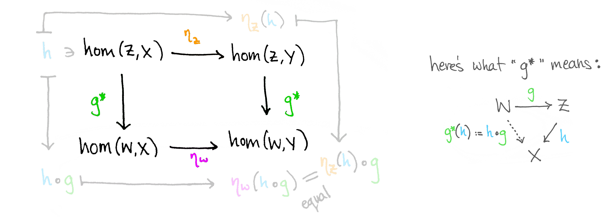
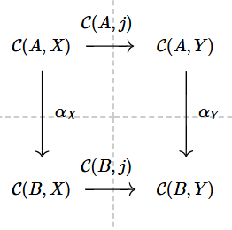

Ah, Yoneda's Lemma! It's like the Swiss army knife of category theory—versatile, a little hard to open at first, but once you figure it out, you'll never leave home without it. So, grab your favorite beverage, maybe even your favorite arrow (just don't point it at me), and let's dive into this categorical adventure.

First, let’s set up the main players in our drama:

If $\alpha$ is a natural transformation from the Hom-functor $\mathcal{C}(A,-):\mathcal{C}\rightarrow\operatorname{Set}$ to the Hom-functor $\mathcal{C}(B,-):\mathcal{C}\rightarrow\operatorname{Set}$, then for any $\mathcal{C}$-arrow $j: X \to Y$, the following diagram commutes like a finely-tuned jazz band:

$$
\\begin{tikzcd}
\\mathcal{C}(A, X) \\arrow[d, "\\alpha_X"] \\arrow[r, "\\mathcal{C}(A,j)"] & \\mathcal{C}(A,Y) \\arrow[d, "\\alpha_Y"] \\\
\\mathcal{C}(B,X) \\arrow[r, "\\mathcal{C}(B,j)"] & \\mathcal{C}(B,Y)
\\end{tikzcd}
$$

Translation: no matter which path you take, everything lands where it's supposed to. This is categorical Zen.

Now, if you really want to see how things act in this setup, let’s introduce an arrow $f: B \to A$. With $f$ in play, you get:

$$
\begin{tikzcd}
B \arrow[d, "f"] & g: A \to X \arrow[rr, "j \circ -"] \arrow[d, "- \circ f"] & & j \circ g: A \to Y \arrow[d, "- \circ f"] \\
A & g \circ f: B \to X \arrow[rr, "j \circ -"] & & j \circ g \circ f: B \to Y
\end{tikzcd}
$$

In other words, for a small category $\mathcal{C}$, we get a natural transformation $\mathcal{C}(f,-): \mathcal{C}(A,-) \Rightarrow \mathcal{C}(B,-)$, defined component-wise as follows: $\mathcal{C}(f,-)_X$ takes an arrow $g: A \to X$ and gives you $g \circ f: B \to X$. Simple enough, right?

But wait—can we go backward? If we start with a natural transformation $\alpha: \mathcal{C}(A,-) \Rightarrow \mathcal{C}(B,-)$, can we reverse engineer it to find an arrow $f: B \to A$? Spoiler alert: Yes, we can! The magic arrow is $f = \alpha_A(1_A)$.

Voilà! Let’s redraw the commutative diagrams, but now with the mighty $f = 1_A$:

$$
\begin{tikzcd}
B \arrow[d, "f"] & 1_A: A \to A \arrow[rr, "j \circ -"] \arrow[d, "\alpha_A(1_A) = - \circ f"] & & j \circ 1_A: A \to Y \arrow[d, "\alpha_Y(j) = - \circ f"] \\
A & 1_A \circ f: B \to A \arrow[rr, "j \circ -"] & & j \circ f: B \to Y
\end{tikzcd}
$$

So, now we see:  
$$(\alpha_A(1_A), -)_Y(j) = \alpha_Y(j)$$  
for all objects $X$ and all arrows $j: A \to X$. All the components of $\alpha$ and $\mathcal{C}(\alpha_A(1_A),-)$ match up perfectly. Great! We’ve proved the existence of such an $f$.

But what is $\mathcal{C}(\alpha_A(1_A),-)$? Let’s recap:

### The Restricted Yoneda Lemma:

> **Theorem**: For any locally small category $\mathcal{C}$ and objects $A$ and $B$, there is a correspondence between arrows $f: B \to A$ and natural transformations $\mathcal{C}(f,-): \mathcal{C}(A,-) \Rightarrow \mathcal{C}(B,-)$.

You just saw the restricted version of the Yoneda Lemma. But we’re not done yet! Oh no, dear reader, we’ve barely scratched the surface. It’s time to bring out the big guns: **isomorphisms**!

> **Theorem**: For any locally small category $\mathcal{C}$ and objects $A, B$:
>
> $$
> \operatorname{Nat}(\mathcal{C}(A,-),\mathcal{C}(B,-)) \cong \mathcal{C}(B,A)
> $$

So, we have a function $\Psi_{AB}$ that takes an arrow $f: B \to A$ and gives us a natural transformation $\mathcal{C}(f,-)$. And in the reverse direction, we have a function $\tilde{\Psi}_{AB}$ that takes a natural transformation $\alpha$ and gives us an arrow $f = \alpha_A(1_A)$.

But wait, there’s more! This setup is so neat that the two functions, when composed, give us back what we started with. That’s right—$(\tilde{\Psi}_{AB} \circ \Psi_{AB})f = f$ and $(\Psi_{AB} \circ \tilde{\Psi}_{AB})\alpha = \alpha$.

### Yoneda Embedding:

> **Theorem**: For any locally small category $\mathcal{C}$, there is a contravariant functor $\Psi: \mathcal{C} \to \operatorname{Set}^{\mathcal{C}}$, which:
>
> 1. Sends objects $A$ to $\mathcal{C}(A,-)$,
> 2. Sends arrows $f: B \to A$ to $\mathcal{C}(f,-): \mathcal{C}(A,-) \Rightarrow \mathcal{C}(B,-)$.

What does this mean? Essentially, $\mathcal{C}$ is chilling inside the functor category $\operatorname{Set}^{\mathcal{C}}$, like some sort of mathematical Inception—it's a category, within a category, within a…well, you get the idea.

And if you’re still with me (which I hope you are), let’s take it up one more notch.

### Yoneda Lemma (Fully Generalized):

For any functor $F: \mathcal{C} \to \operatorname{Set}$ and any object $A \in \mathcal{C}$, there is an isomorphism: $\operatorname{Nat}(\mathcal{C}(A,-), F) \cong FA$ **both naturally in $A$ and naturally in $F**.

And there you have it! The Yoneda Lemma in all its glory. So next time someone asks, “What’s the big deal with this Yoneda guy?” you can calmly sip your coffee, adjust your glasses, and say, “Let me show you a commutative diagram...”

Tadahhh! 🥳
