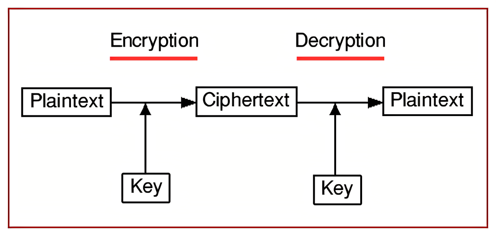

---

##### Download

- [Paper](https://arxiv.org/abs/2208.06002)
- [Online appendix](#)
- [Code and data](#)

---

##### Abstract

In recent years, a lot of research has gone into creating multi-layer chaotic mapping-based cryptosystems. Random-like behavior, a continuous broadband power spectrum, and a weak baseline condition dependency are all characteristics of chaotic systems. Chaos could be helpful in the three functional components of compression, encryption, and modulation in a digital communication system. To successfully use chaos theory in cryptography, chaotic maps must be built in such a way that the entropy they produce can provide the necessary confusion and diffusion. A chaotic map is used in the first layer of such cryptosystems to create confusion, and a second chaotic map is used in the second layer to create diffusion and create a ciphertext from a plaintext. A secret key generation mechanism and a key exchange method are frequently left out, and many researchers just assume that these essential components of any effective cryptosystem are always accessible. We review such cryptosystems by using a cryptosystem of our design, in which confusion in plaintext is created using Arnold's Cat Map, and logistic mapping is employed to create sufficient dispersion and ultimately get a matching ciphertext. We also address the development of key exchange protocols and secret key schemes for these cryptosystems, as well as the possible outcomes of using cryptanalysis techniques on such a system.

---

<!-- ##### Figure 6: Some Uses For Olive Oil -->



---

##### Citation

A. Bhowmik, E. Hossain, and M. Hasan, “A review of cryptosystems based on multi layer chaotic mappings,” arXiv preprint arXiv:2208.06002, 2022.

```BibTeX
@misc{bhowmik2022review,
      title={A review of cryptosystems based on multi layer chaotic mappings},
      author={Awnon Bhowmik and Emon Hossain and Mahmudul Hasan},
      year={2022},
      eprint={2208.06002},
      archivePrefix={arXiv},
      primaryClass={id='cs.CR' full_name='Cryptography and Security' is_active=True alt_name=None in_archive='cs' is_general=False description='Covers all areas of cryptography and security including authentication, public key cryptosytems, proof-carrying code, etc. Roughly includes material in ACM Subject Classes D.4.6 and E.3.'}
}
```

---

##### Related material

- [Slides for long presentation](#)
- [Summary of the paper](#)
